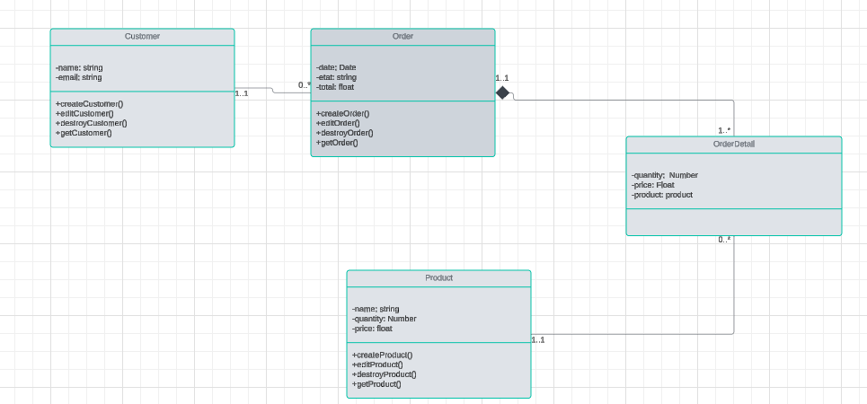

#UML



# Clonez le dépôt de l'application
```git clone https://github.com/Ehya-Ag/exercice1-express.git```

# Accédez au répertoire du dépôt

```cd exercice1-express ```

# Installez les dépendances nécessaires
```npm install```

# Lancez l'application
```npm start```

# exercice1-express
